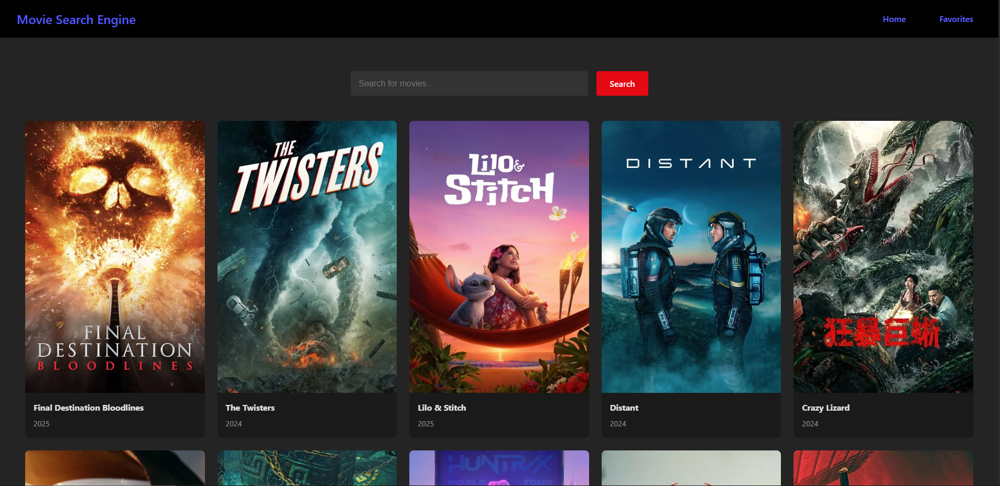

# 🎬 Movie Search Engine

A sleek and responsive React app that lets you search movies, explore popular titles, and save your favorites — all powered by the TMDB API.




## 🚀 Features

- 🔍 **Search Movies:** Find any movie by title with instant results  
- 📈 **Popular Movies:** Browse trending and popular films right on the homepage  
- 💾 **Favorites:** Save your favorite movies for easy access later  
- 🎨 **Responsive Design:** Works beautifully on desktop and mobile  
- ⚡ **Fast & Lightweight:** Built with React and optimized for smooth experience  

## 🛠️ Technologies Used

- React (with hooks and functional components)  
- TMDB (The Movie Database) API  
- CSS3 / Flexbox for styling  
- Environment variables for secure API key management  

## 📦 Getting Started

### Prerequisites

- Node.js (v14 or above)  
- npm or yarn package manager  

### Installation

Clone the repository:

```bash
git clone https://github.com/jerichijer/MovieSearchEngine.git
cd MovieSearchEngine
